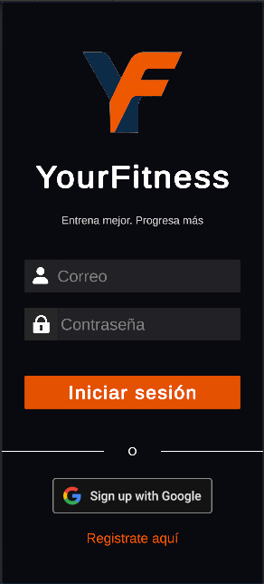
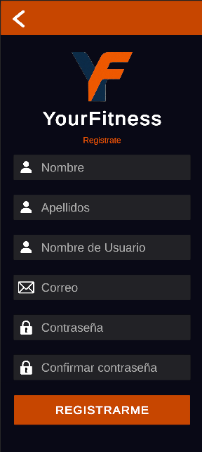
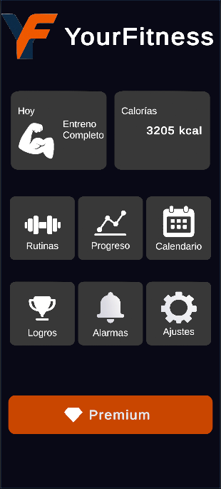
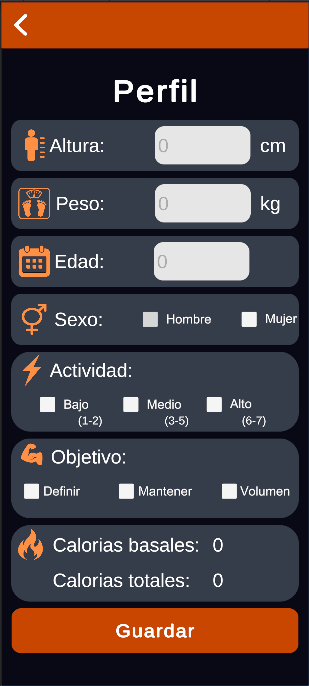
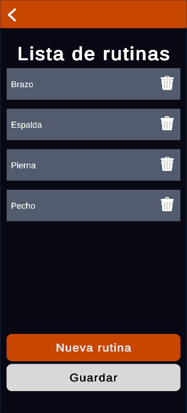
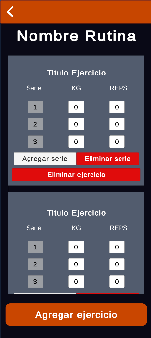
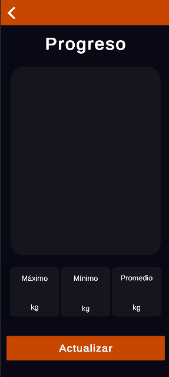

# YourFitnessApp-TFG
YourFitnessApp, aplicación móvil desarrollada en Unity para la planificación y seguimiento del entrenamiento. Incluye perfil de usuario, cálculo de calorías según actividad y objetivo, gestor de rutinas y ejercicios, registro de progreso y persistencia de datos por usuario mediante Firebase.

## 📱 Capturas de la aplicación

### Login 

### Registro

### Menu principal

### Perfil de usuario

### Rutinas

### Creación rutina

### Rutinas ejercicio

### Progreso

